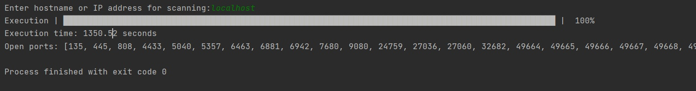

# threaded_server

Реализован сканер портов (показывает количество открытых портов по выбранному адресу) и реализованно подключение клиентов в новый поток.
---

Если пользователь подключается с определенного НОВОГО порта, то клиент предлагает ему зарегистрировать нового пользователя(Ввести логин и пароль)

